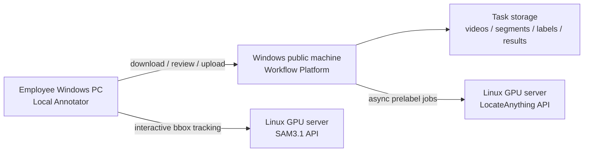

# Video Annotation Workflow

面向团队的视频目标检测与跟踪标注作业平台。项目把长视频任务登记、预标注、分段、轨迹生成、人工清理和 YOLO 数据集导出串成一条可追踪的流程，同时把耗时的 LocateAnything 与 SAM3.1 推理放在 Linux GPU 服务器上。

> 当前状态：内部 MVP。任务登记、视频/YOLO 上传、长视频分段、LocateAnything 分段推理、跟踪融合和基础导出已经可用；segment 级标注包、回传与最终合并仍在完善中，详见 [Roadmap](docs/roadmap.md)。

## System Overview



| Component | Runs on | Responsibility |
| --- | --- | --- |
| `workflow_platform` | Windows public machine | Task registration, upload, assignment, segmentation, remote LocateAnything jobs, tracking and result distribution |
| `annotator` | Employee Windows PC | Low-latency manual inspection and cleanup; calls remote SAM3.1 when needed |
| `mot_pipeline` | Platform or annotator | YOLO parsing, bidirectional tracking, trajectory fusion, smoothing and format conversion |
| `locateAnything` | Linux GPU server | Prompt/multi-class video detection and YOLO prelabel generation |
| `sam31` | Linux GPU server | Bbox-prompt video tracking and `tracking_results.json` generation |

## Annotation Flow

1. Publisher creates a task, class table, assignee and notes on the platform.
2. Upload one or more complete videos and optional full-video YOLO label ZIPs.
3. Split each long video into segments based on scene density and workload.
4. Use uploaded YOLO labels, run segment LocateAnything, or start without prelabels.
5. Run the default MOT tracking/fusion pipeline for each segment.
6. Download an annotation package and clean tracks locally with Annotator.
7. Use remote SAM3.1 interactively for difficult gaps or occlusions.
8. Upload reviewed results and export the final YOLO dataset.

The canonical YOLO line is:

```text
class_id x_center y_center width height score
```

Coordinates are normalized to `[0, 1]`. Input without `score` is also accepted.

## Quick Start

### Windows public platform

```powershell
py -3.11 -m venv .venv
.venv\Scripts\Activate.ps1
pip install -r requirements\platform.txt
Copy-Item configs\platform.example.json configs\platform.local.json
$env:ANNOTATION_PLATFORM_CONFIG="$PWD\configs\platform.local.json"
$env:ANNOTATION_PLATFORM_TASKS_DIR="D:\annotation_tasks"
.\scripts\windows\run-platform.bat
```

Open `http://<public-machine>:8088`.

### Employee annotator

```powershell
py -3.11 -m venv .venv
.venv\Scripts\Activate.ps1
pip install -r requirements\annotator.txt
.\scripts\windows\run-annotator.bat
```

Open `http://127.0.0.1:7860`. SAM3.1 credentials remain on the employee machine and are supplied through workspace config/environment variables.

### Linux GPU services

```bash
# Run each service in its own prepared Python environment.
source /path/to/sam31-env/bin/activate
export SAM31_COMFY_ROOT=/opt/ComfyUI
export SAM31_CHECKPOINT=/models/sam3.1_multiplex_fp16.safetensors
./scripts/linux/run-sam31-server.sh

source /path/to/locateanything-env/bin/activate
./scripts/linux/run-locateanything-server.sh
```

LocateAnything requires Python 3.10+ and a PyTorch build matching the server CUDA runtime. SAM3.1 should run inside the existing ComfyUI environment. Do not install or upgrade GPU PyTorch from the root requirements file.

Verify all deployed endpoints:

```bash
python scripts/check-services.py \
  --platform http://windows-host:8088 \
  --sam31 http://gpu-host:9001 \
  --locateanything http://gpu-host:9011
```

## Repository Layout

```text
annotator/             employee-side annotation UI and API
workflow_platform/     shared task platform UI and API
mot_pipeline/          tracking, fusion and converters
sam31/                 SAM3.1 remote job service and runner
locateAnything/        vendored LocateAnything code plus project adapters
configs/               safe configuration examples
requirements/          dependencies split by deployment role
scripts/windows/       Windows launchers
scripts/linux/         Linux launchers
examples/              local samples and experiments (large data is ignored)
docs/                  architecture, deployment and operations manuals
tests/                 fast unit and project smoke tests
```

`locateAnything/` contains upstream research code and model-license material together with this project's adapters (`locateanything_worker.py`, `locateanything_video_server.py`, `batch_yolo_infer.py`). Treat upstream internals as vendor code; platform-specific changes should stay in the adapter files when possible.

See `locateAnything/PROJECT_ADAPTERS.md` before updating that vendor tree.

## Documentation

- [Architecture and boundaries](docs/architecture.md)
- [平台现有功能与处理逻辑图](docs/platform-capabilities.md)
- [Windows platform deployment](docs/deployment/windows-platform.md)
- [Linux GPU service deployment](docs/deployment/gpu-services.md)
- [Employee annotator setup](docs/deployment/windows-annotator.md)
- [Task operating procedure](docs/operations/task-workflow.md)
- [HTTP API summary](docs/api.md)
- [Configuration reference](docs/configuration.md)
- [Data formats and directory contract](docs/data-contract.md)
- [Troubleshooting](docs/troubleshooting.md)
- [Development and verification](docs/development.md)
- [Roadmap and known limitations](docs/roadmap.md)

## Development

```bash
pip install -r requirements/dev.txt
python -m pytest
python -m compileall annotator workflow_platform mot_pipeline sam31
```

Generated videos, task data, model weights, credentials and local `*.local.json` files are intentionally ignored by Git. This repository currently has no public redistribution license; check internal policy and the separate LocateAnything model license before distributing binaries or model assets.
