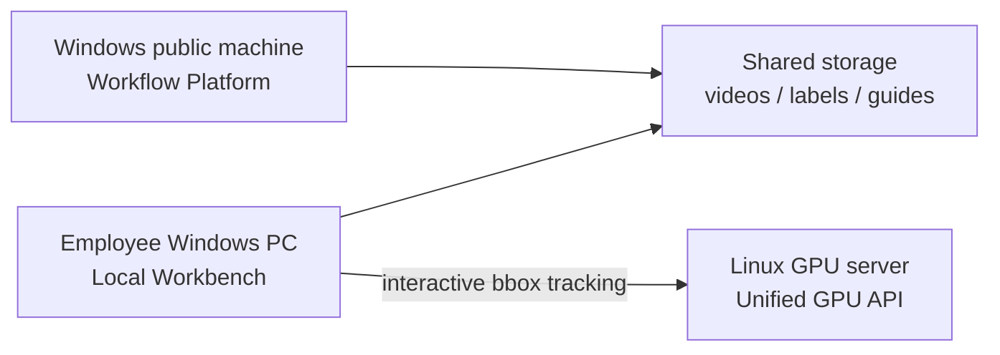

# Video Annotation Workflow

面向部门的通用标注作业平台，支持发布人、负责人、标注员、Part 动态领取、工时、资料附件和问题闭环。视频目标检测任务额外提供长视频分段、LocateAnything 预标注、轨迹融合、缺漏补全、人工清理和 YOLO 导出，并把耗时推理放在 Linux GPU 服务器上。

> 当前状态：内部 MVP。任务登记、视频/YOLO 上传、长视频分段、LocateAnything 分段推理、跟踪融合和基础导出已经可用；segment 级标注包、回传与最终合并仍在完善中，详见 [Roadmap](docs/roadmap.md)。

## System Overview



| Component | Runs on | Responsibility |
| --- | --- | --- |
| `workflow_platform` | Windows public machine | Spreadsheet task publishing, Part claiming, timing, notes, review and team statistics |
| `local_workbench` | Employee Windows PC | One local service exposing manual annotation and frame sampling |
| `annotator` | Local workbench | Low-latency manual inspection, cleanup and remote GPU calls |
| `frame_sampler` | Local workbench | Variable-density training-frame sampling before YOLO export |
| `utils/mot_pipeline` | Local workbench | YOLO parsing, bidirectional tracking, trajectory fusion, smoothing and format conversion |
| `gpu_services` | Linux GPU server | Single API exposing LocateAnything video prelabeling and SAM3.1 bbox tracking |

## Annotation Flow

1. A publisher pastes one or more rows from the annotation task spreadsheet and sets a product tag, Part count and prefix.
2. Annotators claim the next available Part; the platform starts timing automatically.
3. Annotators work with the shared files and local tools, then submit a note for review.
4. The publisher approves the Part or returns it with rework instructions.
5. Rework is timed separately and added to the Part's accumulated work time.
6. GPU prelabeling and local annotation remain independent tools; the platform stores no videos or labels.

The canonical YOLO line is:

```text
class_id x_center y_center width height score
```

Coordinates are normalized to `[0, 1]`. Input without `score` is also accepted.

## Quick Start

### Windows public platform

```powershell
py -3.11 -m venv .venv
.venv\Scripts\Activate.ps1
pip install -r requirements\platform.txt
$env:ANNOTATION_PLATFORM_TASKS_DIR="D:\annotation_tasks"
.\scripts\windows\run-platform.ps1
```

Open `http://<public-machine>:8088`.

Restart an already running platform instance on the configured port:

```powershell
.\scripts\windows\run-platform.ps1 -Restart
```

### Employee local workbench

```powershell
py -3.11 -m venv .venv
.venv\Scripts\Activate.ps1
pip install -r requirements\annotator.txt
.\scripts\windows\run-local-workbench.bat
```

Open `http://127.0.0.1:7860/annotator/` for annotation, or `http://127.0.0.1:7860/sampler/` for frame sampling. The sampler reads a workspace video plus `tracking_results.json`, lets you define dense/sparse ranges, and exports `images/` + `labels/` YOLO data. SAM3.1 credentials remain on the employee machine and are supplied through workspace config/environment variables.

To build a Windows executable, install `requirements\windows-build.txt` and run `scripts\windows\build-local-workbench.ps1`. The generated `VideoAnnotationWorkbench.exe` contains both UIs and their static assets.

On Windows, start the workflow platform with `workflow_platform\run.ps1`. Its default port is `8088`; either edit `$DefaultPort` near the top of that file or override it at launch with `-Port 8090`.

For standalone LocateAnything batch pre-labeling, run `locany_batch_tool\run.ps1`. It opens a Qt desktop interface that tests GPU/SFTP connectivity and provides separate modes for video batches and image-directory inference, with either SFTP upload/download or direct server-side paths. Build the Windows executable with `scripts\windows\build-locany-batch-tool.ps1`.

### Linux GPU services

```bash
# Start one HTTP service from the LocateAnything-capable environment.
source /path/to/locateanything-env/bin/activate
pip install -r requirements/gpu-services.txt
export LOCATEANYTHING_ROOT=/opt/LocateAnything
export SAM31_COMFY_ROOT=/opt/ComfyUI
export SAM31_CHECKPOINT=/models/sam3.1_multiplex_fp16.safetensors
export SAM31_PYTHON=/path/to/sam31-comfy-env/bin/python
./gpu_services/run_gpu_service.sh
```

LocateAnything remains an external runtime: `LOCATEANYTHING_ROOT` must contain `locateanything_worker.py`, and its Python environment needs Python 3.10+ plus CUDA-matched PyTorch. SAM3.1 keeps its existing ComfyUI environment through `SAM31_PYTHON`; the unified service launches its runner as a child process. Do not install or upgrade GPU PyTorch from the root requirements file.

Verify all deployed endpoints:

```bash
python scripts/check-services.py \
  --platform http://windows-host:8088 \
  --gpu-service http://gpu-host:9010
```

## Repository Layout

```text
local_workbench/       single-process local service that mounts both UIs
utils/annotator/       implementation of the annotation UI and API
utils/frame_sampler/   implementation of the variable-density frame sampler
workflow_platform/     lightweight multi-user task collaboration UI and API
utils/mot_pipeline/    shared tracking, fusion and converters
gpu_services/          unified SAM3.1 / LocateAnything HTTP service
configs/               safe configuration examples
requirements/          dependencies split by deployment role
scripts/windows/       Windows launchers
scripts/linux/         Linux launchers
examples/              local samples and experiments (large data is ignored)
docs/                  architecture, deployment and operations manuals
tests/                 fast unit and project smoke tests
```

This repository does not vendor LocateAnything. Install or clone the upstream runtime separately, then set `LOCATEANYTHING_ROOT` to the directory containing `locateanything_worker.py`.

## Documentation

- [Architecture and boundaries](docs/architecture.md)
- [平台现有功能与处理逻辑图](docs/platform-capabilities.md)
- [Windows platform deployment](docs/deployment/windows-platform.md)
- [Linux GPU service deployment](docs/deployment/gpu-services.md)
- [Windows local workbench setup](docs/deployment/windows-local-workbench.md)
- [Task operating procedure](docs/operations/task-workflow.md)
- [HTTP API summary](docs/api.md)
- [Configuration reference](docs/configuration.md)
- [Data formats and directory contract](docs/data-contract.md)
- [Troubleshooting](docs/troubleshooting.md)
- [Development and verification](docs/development.md)
- [Roadmap and known limitations](docs/roadmap.md)

## Development

```bash
pip install -r requirements/dev.txt
python -m pytest
python -m compileall utils local_workbench workflow_platform gpu_services
```

Generated videos, task data, model weights, credentials and local `*.local.json` files are intentionally ignored by Git. This repository currently has no public redistribution license; check internal policy and the separate LocateAnything model license before distributing binaries or model assets.
