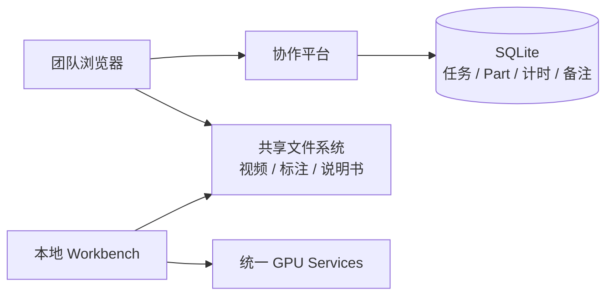

# 系统架构

项目按职责拆成三个互不代办的部分：

- Windows 公共机运行 `workflow_platform`，只保存账号、任务、Part、计时、备注和审核状态。
- 员工 Windows 电脑运行 `local_workbench`，完成视频浏览、人工标注、帧采样、格式导出和按需 GPU 调用。
- Linux GPU 服务器运行 `gpu_services`，提供 LocateAnything 和 SAM3.1 两类 API。

## 协作平台

`workflow_platform/server.py` 提供登录、用户管理、表格任务发布、Part 领取与计时、备注、退修复审和发布者统计。平台只保存任务表中的路径文本，不读取或复制路径对应的文件，也不调用 GPU Services。

SQLite 只使用以下核心关系：

- `users`、`user_sessions`
- `tasks`
- `parts`
- `part_work_sessions`
- `part_comments`

旧数据库可原地增加新任务字段；旧版视频和预处理表即使仍存在，也不会被新服务读取或暴露。

## 本地工作台

`local_workbench/server.py` 把 `utils/annotator` 与 `utils/frame_sampler` 挂载到一个本地服务。Annotator 负责交互式轨迹编辑、质量检查、本地保存、YOLO/VOC 导出和远端 SAM3.1 调用；帧采样器负责按稠密/稀疏计划导出训练帧。

`utils/mot_pipeline` 是本地领域逻辑，负责读取 YOLO 检测框、跟踪、轨迹融合、平滑和格式转换，不再由协作平台调用。

## GPU 服务

统一服务按 `/api/locateanything` 与 `/api/sam31` 分隔接口。耗时任务采用提交 job、轮询状态、获取结果的异步模式。LocateAnything 可由独立 Qt 工具批量调用；SAM3.1 由本地 Workbench 交互调用。

视频传输支持共享路径映射或 SFTP，相关连接设置属于客户端工具和 GPU Services，不属于协作平台。
