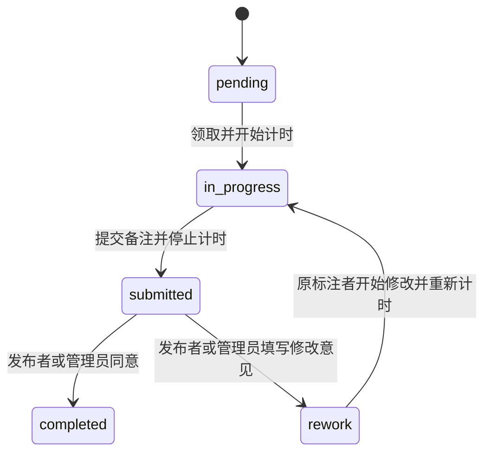
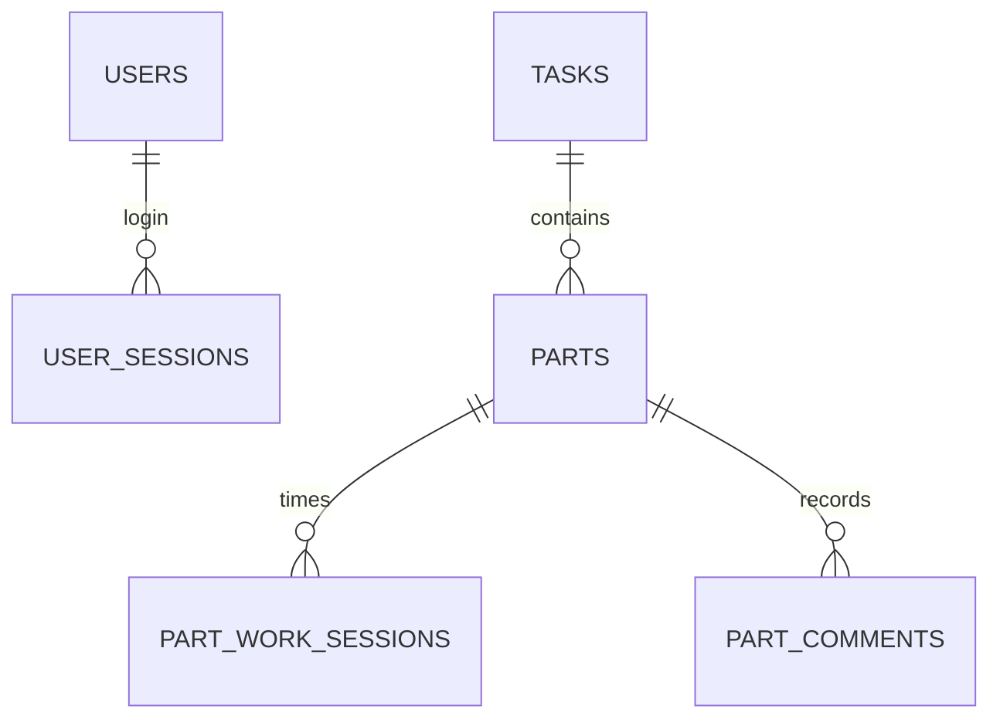

# 多人标注协作平台

`workflow_platform` 只负责人员、任务、Part、计时、备注和审核协作，不上传或处理视频，不调用 GPU Services，也不生成标注文件。

## 任务发布

发布者从 Excel/WPS 直接复制任务表的一行或多行。平台识别以下十列，支持同时粘贴表头：

1. 申请日期
2. 申请人
3. 项目
4. 标注内容
5. 数据集溯源
6. 每小时可标
7. 数据量
8. 预计工时/单人
9. 数据路径
10. 标注说明书路径

发布时额外设置产品大标签，并选择按数量生成 Part，或粘贴扫描脚本生成的 Part 工作目录清单。按数量生成时继续使用 Part 数量和前缀；使用目录清单时，每行目录直接绑定一个 Part。为避免同一清单套到不同数据根目录，目录清单模式一次只发布一行任务。

## Part 工作目录清单

推荐普通使用者直接双击 `PartDirectoryScannerTool.exe`：点击“选择根目录”，调整最大深度或识别标志，扫描并检查结果后点击“复制清单”，再粘贴到平台发布窗口。无需打开 PowerShell。

开发或部署人员可用以下命令构建：

```powershell
pip install -r requirements\part-scanner-windows.txt
.\scripts\windows\build-part-directory-scanner.ps1
```

生成文件为 `dist\PartDirectoryScannerTool.exe`。下面的 PowerShell 扫描脚本保留为高级或自动化用法：

```powershell
powershell -ExecutionPolicy Bypass -File scripts\windows\scan-part-directories.ps1 `
  -Root D:\dataset -MaxDepth 4 -CopyToClipboard
```

脚本把扫描根目录记为深度 `0`，最多检查到 `MaxDepth`。当某个目录的直接子目录中出现 `images`、`labels` 或 `annotations` 时，该目录会被认定为一个工作目录，并停止继续向下扫描，因此不会把这些数据子目录误当作 Part。可通过 `-MarkerDirectories` 修改标志目录，通过 `-MinimumMarkerCount 2` 要求至少命中两个标志以减少误判。

默认清单是相对于扫描根目录的路径：

```text
split_001
camera_a/split_002
```

平台根据任务表中的“数据路径”拼出完整工作路径。也可以手工使用两列格式 `显示名称<Tab>目录路径`，或直接粘贴完整 UNC、Windows、Linux 路径。标注者领取后会在 Part 卡片中看到并可复制实际工作目录。

## 权限

- 所有登录用户都能查看任务并领取待领取 Part；发布者也可以领取自己发布的任务。
- 标注者只能看到自己的 Part、备注和计时，以及任务整体数量进度。
- 只有任务发布者能编辑或删除任务、追加 Part、查看所有人的综合统计。
- 任务发布者和管理员都能查看任务的完整 Part 明细，并对待审核 Part 执行同意或退回修改。
- 发布者可以删除任意状态的自有任务，包括进行中、待审核和已完成的任务。
- 编辑任务时可更新产品标签、Part 前缀和任务表格中的十项信息；新前缀只用于之后追加的 Part。
- 管理员负责平台账号管理和 Part 审核；管理员不会自动获得其他发布者任务的个人统计或任务编辑权限。

## Part 状态



每次提交、审核和补充备注均保留历史。累计工时是首次标注与各次返工计时之和。

## 数据关系


