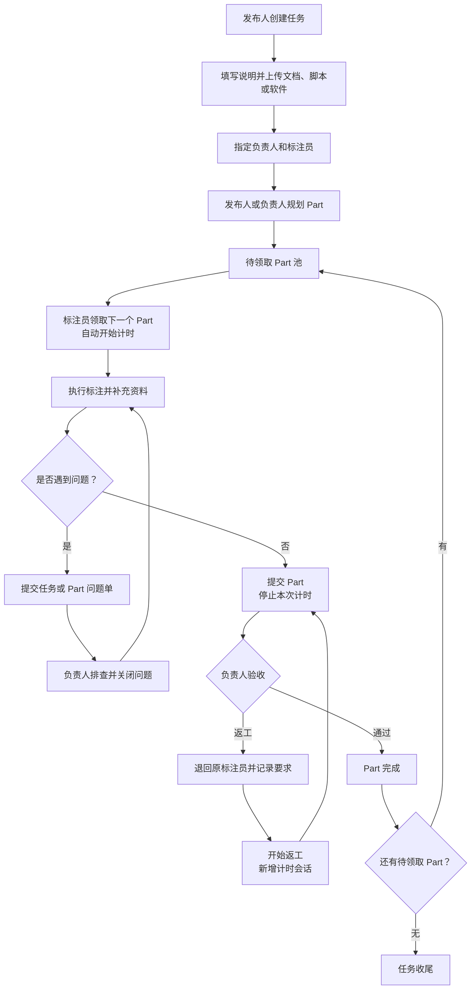
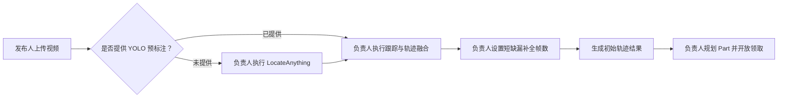
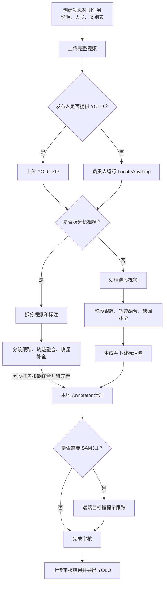
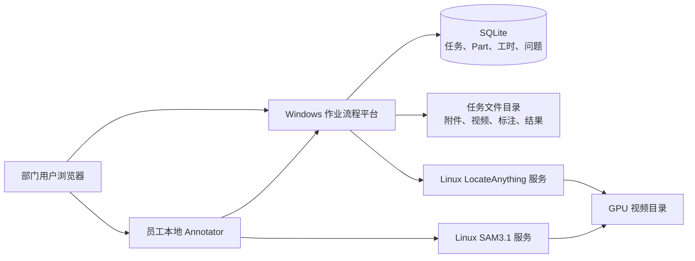
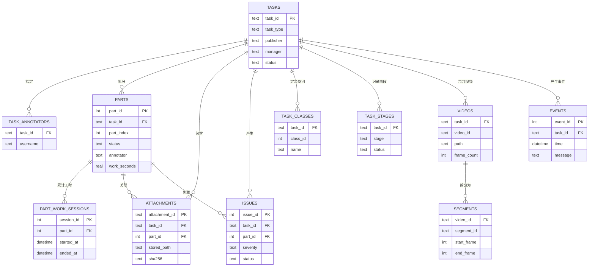
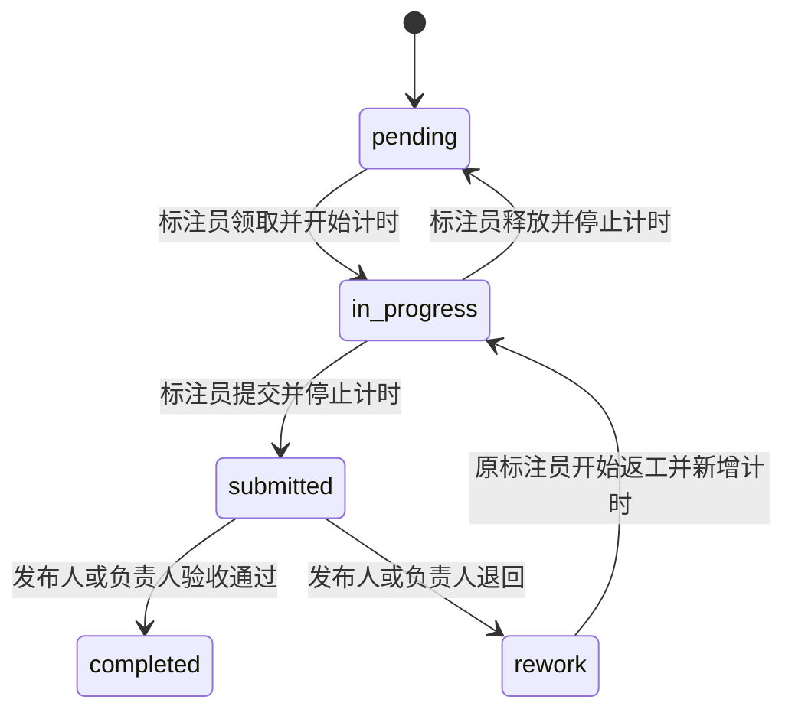

# 平台现有功能与处理逻辑

平台以通用标注作业为主，视频目标检测是带专用预处理步骤的一种任务类型。本文只描述当前代码已经实现的能力。

## 部门作业主流程

## 角色职责

| 角色 | 当前支持的操作 |
| --- | --- |
| 发布人 | 创建任务、填写说明、上传资料、指定负责人和标注员、增加 Part、查看进度、验收 Part、解决问题 |
| 负责人 | 维护任务与人员、增加 Part、查看每个 Part 累计耗时、验收或退回、排查问题；视频检测任务中负责预处理 |
| 标注员 | 从公共 Part 池领取下一份工作、自动计时、提交或释放 Part、处理返工、上传资料、报告问题 |

浏览器保存“当前操作人”，后端据此进行业务角色校验。当前尚无登录和身份认证，因此只适用于可信内部网络。

## 功能总表

| 功能域 | 当前支持情况 | 说明与边界 |
| --- | --- | --- |
| 任务登记 | 已支持 | 通用任务与视频目标检测任务 |
| 任务说明 | 已支持 | 发布人提供长文本要求，并可持续维护 |
| 人员角色 | 已支持 | 发布人、负责人和多个标注员 |
| 资料附件 | 已支持 | 上传文档、脚本、软件或其他文件；平台只保存和下载，不执行附件 |
| Part 规划 | 已支持 | 创建任务时或执行中批量增加 Part |
| 动态领取 | 已支持 | 标注员原子领取下一个待处理 Part，避免重复领取 |
| Part 工时 | 已支持 | 领取或返工开始时计时，提交或释放时停止，多次会话累计 |
| Part 验收 | 已支持 | 发布人或负责人通过，或退回原标注员返工 |
| 问题排查 | 已支持 | 任务级或 Part 级问题单，支持严重程度和负责人关闭 |
| 任务查询与修改 | 已支持 | 列表、详情、阶段、事件、角色、说明和人员维护 |
| 任务删除 | 已支持 | 软删除，只隐藏记录，不删除磁盘文件 |
| 多视频任务 | 基础支持 | 一个任务可上传多个视频；完整视频切换工作流尚待完善 |
| YOLO 预标注上传 | 已支持 | 安全解压 ZIP 并归档当前视频的 TXT 标注 |
| 长视频分段 | 已支持 | 按帧数拆分视频并同步重编号已有 YOLO 标注 |
| LocateAnything | 已支持 | 整段或逐分段远端推理，支持多类别映射 |
| 跟踪与轨迹融合 | 已支持 | 整段或逐分段执行，并插值轨迹内部短缺口 |
| 标注包、审核、YOLO 导出 | 仅整段视频 | 分段级完整闭环仍待完善 |
| SAM3.1 辅助跟踪 | Annotator 支持 | 由员工本地 Annotator 调用 |
| SQLite 持久化 | 已支持 | 保存角色、Part、工时、附件索引、问题、视频和事件 |
| 旧数据迁移 | 已支持 | 自动导入旧 `task.json` 和 `events.jsonl` |
| GPU 任务队列 | 基础支持 | 进程内串行锁；取消、优先级和持久队列尚未实现 |
| 用户认证 | 未支持 | 当前操作人不是安全登录身份 |

## 视频检测预处理责任链

该流程只在任务类型为“视频目标检测”时显示，并由发布人或负责人操作。

## 视频目标检测完整流程

## 系统调用逻辑

## SQLite 数据关系

## Part 状态与计时

