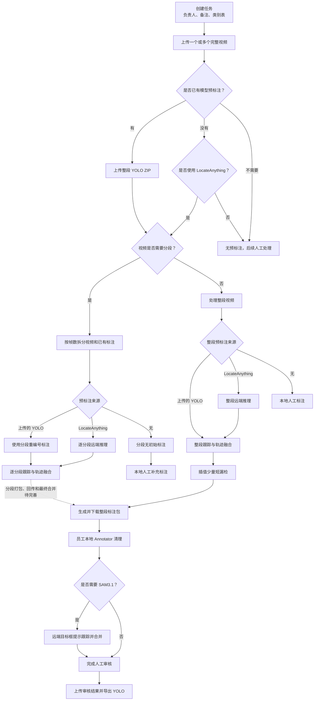
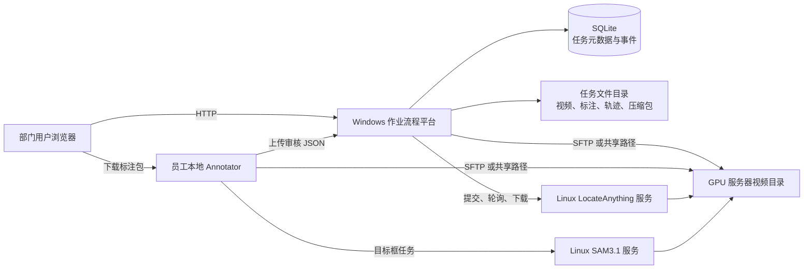
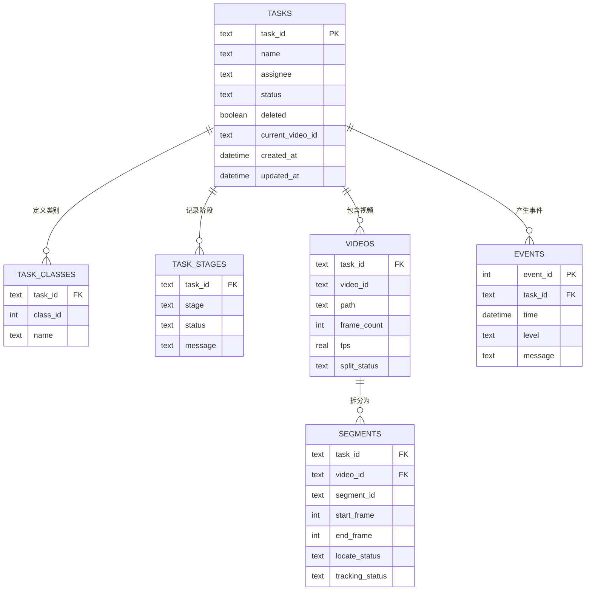
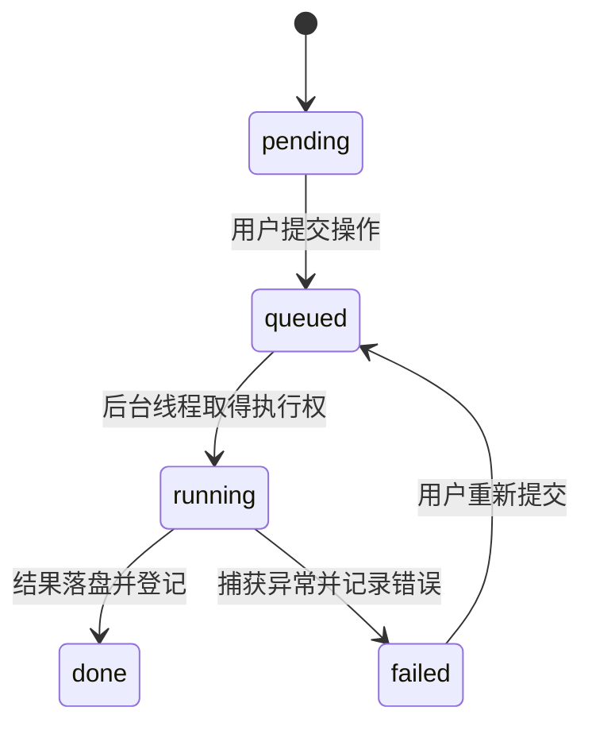

# 平台现有功能与处理逻辑

本文档描述当前代码已经实现的能力，不把路线图中的计划功能算作现成功能。

## 功能总表

| 功能域 | 当前支持情况 | 说明与边界 |
| --- | --- | --- |
| 任务登记 | 已支持 | 创建任务、填写负责人、备注、提示词和类别表 |
| 任务查询 | 已支持 | 列表、详情、阶段状态、最近 100 条事件 |
| 任务修改 | 已支持 | 修改名称、负责人、备注、提示词和类别映射 |
| 任务删除 | 已支持 | 软删除，只隐藏记录，不删除磁盘文件 |
| 多视频任务 | 基础支持 | 一个任务可上传多个视频；界面主要操作当前视频，尚无完整的视频切换工作流 |
| 视频上传 | 已支持 | 支持 MP4、AVI、MKV、MOV、WEBM |
| YOLO 预标注上传 | 已支持 | 上传 ZIP，安全解压并归档当前视频的 TXT 标注 |
| 长视频分段 | 已支持 | 按固定帧数拆分视频，并同步重编号已有 YOLO 标注 |
| LocateAnything 整段推理 | 已支持 | 异步提交远端任务，轮询并下载 YOLO ZIP |
| LocateAnything 分段推理 | 已支持 | 按当前视频的全部分段顺序推理，记录每段状态 |
| 多类别 LocateAnything | 已支持 | 根据任务类别表发送 `categories` 和 `class_map` |
| 整段轨迹生成 | 已支持 | 读取上传或 LocateAnything 标注，执行双向跟踪与融合 |
| 分段轨迹生成 | 已支持 | 对有标注的分段逐段执行跟踪，对无标注分段标记为跳过 |
| 短漏检补全 | 已支持 | 跟踪后按配置帧数插值轨迹内部的短缺口 |
| 标注包生成 | 仅整段视频 | 打包视频、`tracking_results.json`、预览和任务快照 |
| 人工审核结果上传 | 仅整段视频 | 接收审核后的 `tracking_results.json` |
| YOLO 最终导出 | 仅整段视频 | 优先使用审核结果，否则使用整段跟踪结果 |
| SAM3.1 辅助跟踪 | Annotator 支持 | 由员工本地 Annotator 调用，不在公共平台任务页内执行 |
| 元数据持久化 | 已支持 | SQLite 保存任务、类别、阶段、视频、分段和事件 |
| 旧数据迁移 | 已支持 | 首次启动自动导入旧 `task.json` 和 `events.jsonl`，原文件保留 |
| GPU 任务队列 | 基础支持 | 平台进程内串行锁；重启恢复、取消、优先级和持久队列尚未实现 |
| 用户与权限 | 未支持 | 当前无登录、角色和任务级权限，只适合可信内网 |

## 端到端作业逻辑

## 系统调用逻辑

## SQLite 数据关系

视频、模型权重和生成文件不写入数据库，只在数据库中保存路径和状态。

## 状态记录逻辑

任务顶层 `status` 用于列表快速显示，`task_stages` 则分别记录视频、预标注、LocateAnything、跟踪、打包、审核和导出阶段。长任务在执行过程中会持续更新对应阶段：

SQLite 使用 WAL 模式和每次操作独立连接，平台内写入再通过进程内可重入锁串行化。该设计支持当前后台线程并发读写，但尚不能替代跨进程任务队列。
